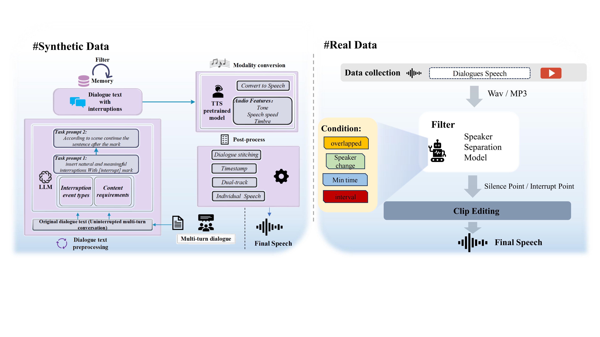

{:.no_toc}

## Overview

In this paper, we present ControlSpeech, a text-to-speech (TTS) system capable of fully cloning the speaker's voice and enabling arbitrary control and adjustment of speaking style, merely based on a few seconds of audio prompt and a simple textual style description prompt. Prior zero-shot TTS models and controllable TTS models either could only mimic the speaker's voice without further control and adjustment capabilities or were unrelated to speaker-specific voice generation. Therefore, ControlSpeech focuses on a more challenging new task—a TTS system with controllable timbre, content, and style at the same time. ControlSpeech takes speech prompts, content prompts, and style prompts as inputs and utilizes bidirectional attention and mask-based parallel decoding to capture corresponding codec representations in a discrete decoupling codec space. Moreover, we discovered the issue of text style controllability in a many-to-many mapping fashion and proposed the SMSD module to resolve this problem. SMSD module which is based on Gaussian mixture density networks, is designed to further mix sample style semantic information and generate speech with more diverse styles. In terms of experiments, we open source a controllable model toolkit called ControlToolkit with a new style controllable dataset, some replicated baseline models and propose new metrics to evaluate both the control capability and the quality of generated audio in ControlSpeech. The relevant ablation studies validate the necessity of each component in ControlSpeech is necessary.  We hope that ControlSpeech can establish the next foundation paradigm of controllable speech synthesis. 

## Model Architecture

Figure (a) illustrates the overall architecture of ControlSpeech, which is an encoder-decoder-based parallel disentangled codec generation model. Figure (b) depicts the SMSD module, which alleviates the many-to-many problem in style control by sampling from the style mixture semantic distribution and incorporating an additional noise perturbator. Figure (c) shows the basic disentanglement process of the codec generator. Through masking, the codec can generate discrete codec representations in a fully non-autoregressive manner.

<table>
    <tr>
        <td >
 
</td>
    </tr>
</table>

Figure.1 The overall architecture of ControlSpeech.

## Compare with baselines

We provide a range of audio to exemplify the differences between ControlSpeech and the baseline models (InstructTTS, PromptStyle and PromptTTS).

<b>Content Prompt:</b> Here a customer came in. 
<b>Style Prompt:</b> The speaker's tone was deep and captivating. 
<b>Voice Prompt:</b><audio controls id="player" onplay="pauseOthers(this);"><source src="assets/audio/voice/1.wav" type="audio/mpeg"></audio>

 
<table>
    <tr>
        <th> GT(w/o Style)</th>
        <th> InstructTTS</th>
        <th> PromptTTS</th>
        <th> PromptStyle</th>
        <th> ControlSpeech(Ours)</th>
    </tr>
    <tr>
        <th> <audio controls id="player" onplay="pauseOthers(this);"><source src="assets/audio/baselines/1/GT.wav" type="audio/mpeg"></audio> </th>
        <th> <audio controls id="player" onplay="pauseOthers(this);"><source src="assets/audio/baselines/1/InstructTTS.wav" type="audio/mpeg"></audio> </th>
        <th> <audio controls id="player" onplay="pauseOthers(this);"><source src="assets/audio/baselines/1/PromptTTS.wav" type="audio/mpeg"></audio> </th>
        <th> <audio controls id="player" onplay="pauseOthers(this);"><source src="assets/audio/baselines/1/PromptStyle.wav" type="audio/mpeg"></audio> </th>
        <th> <audio controls id="player" onplay="pauseOthers(this);"><source src="assets/audio/baselines/1/ControlSpeech.wav" type="audio/mpeg"></audio> </th>
    </tr> 
</table>
 

<b>Content Prompt:</b> He would have withdrawn from the feast had not the noise of voices allayed the smart. 
<b>Style Prompt:</b> A young speaker's low-energy, whispered speech is rapid. 
<b>Voice Prompt:</b><audio controls id="player" onplay="pauseOthers(this);"><source src="assets/audio/voice/2.wav" type="audio/mpeg"></audio>

 
<table>
    <tr>
        <th> GT(w/o Style)</th>
        <th> InstructTTS</th>
        <th> PromptTTS</th>
        <th> PromptStyle</th>
        <th> ControlSpeech(Ours)</th>
    </tr>
    <tr>
        <th> <audio controls id="player" onplay="pauseOthers(this);"><source src="assets/audio/baselines/2/GT.wav" type="audio/mpeg"></audio> </th>
        <th> <audio controls id="player" onplay="pauseOthers(this);"><source src="assets/audio/baselines/2/InstructTTS.wav" type="audio/mpeg"></audio> </th>
        <th> <audio controls id="player" onplay="pauseOthers(this);"><source src="assets/audio/baselines/2/PromptTTS.wav" type="audio/mpeg"></audio> </th>
        <th> <audio controls id="player" onplay="pauseOthers(this);"><source src="assets/audio/baselines/2/PromptStyle.wav" type="audio/mpeg"></audio> </th>
        <th> <audio controls id="player" onplay="pauseOthers(this);"><source src="assets/audio/baselines/2/ControlSpeech.wav" type="audio/mpeg"></audio> </th>
    </tr> 
</table>
 

<b>Content Prompt:</b> Yes, captain, maybe so. 
<b>Style Prompt:</b> A speaker, maintaining a standard pitch, engages in unhurried speech with a touch of normal energy. 
<b>Voice Prompt:</b><audio controls id="player" onplay="pauseOthers(this);"><source src="assets/audio/voice/3.wav" type="audio/mpeg"></audio>

 
<table>
    <tr>
        <th> GT(w/o Style)</th>
        <th> InstructTTS</th>
        <th> PromptTTS</th>
        <th> PromptStyle</th>
        <th> ControlSpeech(Ours)</th>
    </tr>
    <tr>
        <th> <audio controls id="player" onplay="pauseOthers(this);"><source src="assets/audio/baselines/3/GT.wav" type="audio/mpeg"></audio> </th>
        <th> <audio controls id="player" onplay="pauseOthers(this);"><source src="assets/audio/baselines/3/InstructTTS.wav" type="audio/mpeg"></audio> </th>
        <th> <audio controls id="player" onplay="pauseOthers(this);"><source src="assets/audio/baselines/3/PromptTTS.wav" type="audio/mpeg"></audio> </th>
        <th> <audio controls id="player" onplay="pauseOthers(this);"><source src="assets/audio/baselines/3/PromptStyle.wav" type="audio/mpeg"></audio> </th>
        <th> <audio controls id="player" onplay="pauseOthers(this);"><source src="assets/audio/baselines/3/ControlSpeech.wav" type="audio/mpeg"></audio> </th>
    </tr> 
</table>
 

<b>Content Prompt:</b> He dropped the lighted shaving in a safe spot and put up his hands. 
<b>Style Prompt:</b> Speaker's speaking rate is normal, despite speaker's voice's high pitch. 
<b>Voice Prompt:</b><audio controls id="player" onplay="pauseOthers(this);"><source src="assets/audio/voice/4.wav" type="audio/mpeg"></audio>

 
<table>
    <tr>
        <th> GT(w/o Style)</th>
        <th> InstructTTS</th>
        <th> PromptTTS</th>
        <th> PromptStyle</th>
        <th> ControlSpeech(Ours)</th>
    </tr>
    <tr>
        <th> <audio controls id="player" onplay="pauseOthers(this);"><source src="assets/audio/baselines/4/GT.wav" type="audio/mpeg"></audio> </th>
        <th> <audio controls id="player" onplay="pauseOthers(this);"><source src="assets/audio/baselines/4/InstructTTS.wav" type="audio/mpeg"></audio> </th>
        <th> <audio controls id="player" onplay="pauseOthers(this);"><source src="assets/audio/baselines/4/PromptTTS.wav" type="audio/mpeg"></audio> </th>
        <th> <audio controls id="player" onplay="pauseOthers(this);"><source src="assets/audio/baselines/4/PromptStyle.wav" type="audio/mpeg"></audio> </th>
        <th> <audio controls id="player" onplay="pauseOthers(this);"><source src="assets/audio/baselines/4/ControlSpeech.wav" type="audio/mpeg"></audio> </th>
    </tr> 
</table>
 

<b>Content Prompt:</b> He never comes to the pump room, I suppose? 
<b>Style Prompt:</b> The speaker's energy is low, yet speaker's whispering speed is ordinary. 
<b>Voice Prompt:</b><audio controls id="player" onplay="pauseOthers(this);"><source src="assets/audio/voice/5.wav" type="audio/mpeg"></audio>

 
<table>
    <tr>
        <th> GT(w/o Style)</th>
        <th> InstructTTS</th>
        <th> PromptTTS</th>
        <th> PromptStyle</th>
        <th> ControlSpeech(Ours)</th>
    </tr>
    <tr>
        <th> <audio controls id="player" onplay="pauseOthers(this);"><source src="assets/audio/baselines/5/GT.wav" type="audio/mpeg"></audio> </th>
        <th> <audio controls id="player" onplay="pauseOthers(this);"><source src="assets/audio/baselines/5/InstructTTS.wav" type="audio/mpeg"></audio> </th>
        <th> <audio controls id="player" onplay="pauseOthers(this);"><source src="assets/audio/baselines/5/PromptTTS.wav" type="audio/mpeg"></audio> </th>
        <th> <audio controls id="player" onplay="pauseOthers(this);"><source src="assets/audio/baselines/5/PromptStyle.wav" type="audio/mpeg"></audio> </th>
        <th> <audio controls id="player" onplay="pauseOthers(this);"><source src="assets/audio/baselines/5/ControlSpeech.wav" type="audio/mpeg"></audio> </th>
    </tr> 
</table>
 

<b>Content Prompt:</b> Then she cried quickly, "Stay, brother, stay! do not drink, or you will become a wild beast, and tear me to pieces." 
<b>Style Prompt:</b> Speaking in a balanced tone and pace, speaker gets speaker's point across. 
<b>Voice Prompt:</b><audio controls id="player" onplay="pauseOthers(this);"><source src="assets/audio/voice/6.wav" type="audio/mpeg"></audio>

 
<table>
    <tr>
        <th> GT(w/o Style)</th>
        <th> InstructTTS</th>
        <th> PromptTTS</th>
        <th> PromptStyle</th>
        <th> ControlSpeech(Ours)</th>
    </tr>
    <tr>
        <th> <audio controls id="player" onplay="pauseOthers(this);"><source src="assets/audio/baselines/6/GT.wav" type="audio/mpeg"></audio> </th>
        <th> <audio controls id="player" onplay="pauseOthers(this);"><source src="assets/audio/baselines/6/InstructTTS.wav" type="audio/mpeg"></audio> </th>
        <th> <audio controls id="player" onplay="pauseOthers(this);"><source src="assets/audio/baselines/6/PromptTTS.wav" type="audio/mpeg"></audio> </th>
        <th> <audio controls id="player" onplay="pauseOthers(this);"><source src="assets/audio/baselines/6/PromptStyle.wav" type="audio/mpeg"></audio> </th>
        <th> <audio controls id="player" onplay="pauseOthers(this);"><source src="assets/audio/baselines/6/ControlSpeech.wav" type="audio/mpeg"></audio> </th>
    </tr> 
</table>
 

<b>Content Prompt:</b> Fort lyon, colorado territory, december, eighteen seventy one. 
<b>Style Prompt:</b> The speaker talks at a moderate speed, neither too fast nor slow. 
<b>Voice Prompt:</b><audio controls id="player" onplay="pauseOthers(this);"><source src="assets/audio/voice/7.wav" type="audio/mpeg"></audio>

 
<table>
    <tr>
        <th> GT(w/o Style)</th>
        <th> InstructTTS</th>
        <th> PromptTTS</th>
        <th> PromptStyle</th>
        <th> ControlSpeech(Ours)</th>
    </tr>
    <tr>
        <th> <audio controls id="player" onplay="pauseOthers(this);"><source src="assets/audio/baselines/7/GT.wav" type="audio/mpeg"></audio> </th>
        <th> <audio controls id="player" onplay="pauseOthers(this);"><source src="assets/audio/baselines/7/InstructTTS.wav" type="audio/mpeg"></audio> </th>
        <th> <audio controls id="player" onplay="pauseOthers(this);"><source src="assets/audio/baselines/7/PromptTTS.wav" type="audio/mpeg"></audio> </th>
        <th> <audio controls id="player" onplay="pauseOthers(this);"><source src="assets/audio/baselines/7/PromptStyle.wav" type="audio/mpeg"></audio> </th>
        <th> <audio controls id="player" onplay="pauseOthers(this);"><source src="assets/audio/baselines/7/ControlSpeech.wav" type="audio/mpeg"></audio> </th>
    </tr> 
</table>
 

<b>Content Prompt:</b> Once Layelah sat for some time silent and involved in thought. 
<b>Style Prompt:</b> The speaker's low-pitched voice delivers speaker's message with a moderate level of energy and standard speaking speed. 
<b>Voice Prompt:</b><audio controls id="player" onplay="pauseOthers(this);"><source src="assets/audio/voice/8.wav" type="audio/mpeg"></audio>

 
<table>
    <tr>
        <th> GT(w/o Style)</th>
        <th> InstructTTS</th>
        <th> PromptTTS</th>
        <th> PromptStyle</th>
        <th> ControlSpeech(Ours)</th>
    </tr>
    <tr>
        <th> <audio controls id="player" onplay="pauseOthers(this);"><source src="assets/audio/baselines/8/GT.wav" type="audio/mpeg"></audio> </th>
        <th> <audio controls id="player" onplay="pauseOthers(this);"><source src="assets/audio/baselines/8/InstructTTS.wav" type="audio/mpeg"></audio> </th>
        <th> <audio controls id="player" onplay="pauseOthers(this);"><source src="assets/audio/baselines/8/PromptTTS.wav" type="audio/mpeg"></audio> </th>
        <th> <audio controls id="player" onplay="pauseOthers(this);"><source src="assets/audio/baselines/8/PromptStyle.wav" type="audio/mpeg"></audio> </th>
        <th> <audio controls id="player" onplay="pauseOthers(this);"><source src="assets/audio/baselines/8/ControlSpeech.wav" type="audio/mpeg"></audio> </th>
    </tr> 
</table>
 

<b>Content Prompt:</b> I see you just as feeble minded as you were before, and still expressing only despair! 
<b>Style Prompt:</b> The speaker's high-energy speech is delivered swiftly, yet speaker's pitch remains steady. 
<b>Voice Prompt:</b><audio controls id="player" onplay="pauseOthers(this);"><source src="assets/audio/voice/9.wav" type="audio/mpeg"></audio>

 
<table>
    <tr>
        <th> GT(w/o Style)</th>
        <th> InstructTTS</th>
        <th> PromptTTS</th>
        <th> PromptStyle</th>
        <th> ControlSpeech(Ours)</th>
    </tr>
    <tr>
        <th> <audio controls id="player" onplay="pauseOthers(this);"><source src="assets/audio/baselines/9/GT.wav" type="audio/mpeg"></audio> </th>
        <th> <audio controls id="player" onplay="pauseOthers(this);"><source src="assets/audio/baselines/9/InstructTTS.wav" type="audio/mpeg"></audio> </th>
        <th> <audio controls id="player" onplay="pauseOthers(this);"><source src="assets/audio/baselines/9/PromptTTS.wav" type="audio/mpeg"></audio> </th>
        <th> <audio controls id="player" onplay="pauseOthers(this);"><source src="assets/audio/baselines/9/PromptStyle.wav" type="audio/mpeg"></audio> </th>
        <th> <audio controls id="player" onplay="pauseOthers(this);"><source src="assets/audio/baselines/9/ControlSpeech.wav" type="audio/mpeg"></audio> </th>
    </tr> 
</table>
 

<b>Content Prompt:</b> They'd never know I'd regular ran away. 
<b>Style Prompt:</b> Speaker's speech maintains a usual pitch as speaker mournfully talks at a regular speed with a touch of standard energy. 
<b>Voice Prompt:</b><audio controls id="player" onplay="pauseOthers(this);"><source src="assets/audio/voice/10.wav" type="audio/mpeg"></audio>

 
<table>
    <tr>
        <th> GT(w/o Style)</th>
        <th> InstructTTS</th>
        <th> PromptTTS</th>
        <th> PromptStyle</th>
        <th> ControlSpeech(Ours)</th>
    </tr>
    <tr>
        <th> <audio controls id="player" onplay="pauseOthers(this);"><source src="assets/audio/baselines/10/GT.wav" type="audio/mpeg"></audio> </th>
        <th> <audio controls id="player" onplay="pauseOthers(this);"><source src="assets/audio/baselines/10/InstructTTS.wav" type="audio/mpeg"></audio> </th>
        <th> <audio controls id="player" onplay="pauseOthers(this);"><source src="assets/audio/baselines/10/PromptTTS.wav" type="audio/mpeg"></audio> </th>
        <th> <audio controls id="player" onplay="pauseOthers(this);"><source src="assets/audio/baselines/10/PromptStyle.wav" type="audio/mpeg"></audio> </th>
        <th> <audio controls id="player" onplay="pauseOthers(this);"><source src="assets/audio/baselines/10/ControlSpeech.wav" type="audio/mpeg"></audio> </th>
    </tr> 
</table>
 

<b>Content Prompt:</b> Hold up my chin, slow and solid. 
<b>Style Prompt:</b> Speaking quickly and with a low-pitched voice, speaker amazedly embodies the liveliness associated with normalcy. 
<b>Voice Prompt:</b><audio controls id="player" onplay="pauseOthers(this);"><source src="assets/audio/voice/11.wav" type="audio/mpeg"></audio>

 
<table>
    <tr>
        <th> GT(w/o Style)</th>
        <th> InstructTTS</th>
        <th> PromptTTS</th>
        <th> PromptStyle</th>
        <th> ControlSpeech(Ours)</th>
    </tr>
    <tr>
        <th> <audio controls id="player" onplay="pauseOthers(this);"><source src="assets/audio/baselines/11/GT.wav" type="audio/mpeg"></audio> </th>
        <th> <audio controls id="player" onplay="pauseOthers(this);"><source src="assets/audio/baselines/11/InstructTTS.wav" type="audio/mpeg"></audio> </th>
        <th> <audio controls id="player" onplay="pauseOthers(this);"><source src="assets/audio/baselines/11/PromptTTS.wav" type="audio/mpeg"></audio> </th>
        <th> <audio controls id="player" onplay="pauseOthers(this);"><source src="assets/audio/baselines/11/PromptStyle.wav" type="audio/mpeg"></audio> </th>
        <th> <audio controls id="player" onplay="pauseOthers(this);"><source src="assets/audio/baselines/11/ControlSpeech.wav" type="audio/mpeg"></audio> </th>
    </tr> 
</table>
 

<b>Content Prompt:</b> It looks much better. 
<b>Style Prompt:</b> Speaking rapidly in a low pitch, the surprised speaker's energy remains minimal. 
<b>Voice Prompt:</b><audio controls id="player" onplay="pauseOthers(this);"><source src="assets/audio/voice/12.wav" type="audio/mpeg"></audio>

 
<table>
    <tr>
        <th> GT(w/o Style)</th>
        <th> InstructTTS</th>
        <th> PromptTTS</th>
        <th> PromptStyle</th>
        <th> ControlSpeech(Ours)</th>
    </tr>
    <tr>
        <th> <audio controls id="player" onplay="pauseOthers(this);"><source src="assets/audio/baselines/12/GT.wav" type="audio/mpeg"></audio> </th>
        <th> <audio controls id="player" onplay="pauseOthers(this);"><source src="assets/audio/baselines/12/InstructTTS.wav" type="audio/mpeg"></audio> </th>
        <th> <audio controls id="player" onplay="pauseOthers(this);"><source src="assets/audio/baselines/12/PromptTTS.wav" type="audio/mpeg"></audio> </th>
        <th> <audio controls id="player" onplay="pauseOthers(this);"><source src="assets/audio/baselines/12/PromptStyle.wav" type="audio/mpeg"></audio> </th>
        <th> <audio controls id="player" onplay="pauseOthers(this);"><source src="assets/audio/baselines/12/ControlSpeech.wav" type="audio/mpeg"></audio> </th>
    </tr> 
</table>
 

## Style control for unseen speakers

We provide a series of audio to demonstrate ContorSpeech's ability to control the style of unseen speakers.

<b>Content Prompt:</b> I was never in the county till my husband brought me here. Mrs Charmond did not care to pursue this line of investigation.
 
<b>Style Prompt:</b> The pitch of speaker's speech is within the norm.
 
<b>Voice Prompt:</b> Note that the timbre is derived from GT wav.

 
<table>
    <tr>
        <th> GT wav</th>
        <th> Generated wav</th>
    </tr>
    <tr>
        <th> <audio controls id="player" onplay="pauseOthers(this);"><source src="assets/audio/unseen/1/GT.wav" type="audio/mpeg"></audio> </th>
        <th> <audio controls id="player" onplay="pauseOthers(this);"><source src="assets/audio/unseen/1/Generated.wav" type="audio/mpeg"></audio> </th>
    </tr> 
</table>
 

<b>Content Prompt:</b> It is made of silk or cotton.
 
<b>Style Prompt:</b> The speaker communicates with minimal energy.
 
<b>Voice Prompt:</b> Note that the timbre is derived from GT wav.

 
<table>
    <tr>
        <th> GT wav</th>
        <th> Generated wav</th>
    </tr>
    <tr>
        <th> <audio controls id="player" onplay="pauseOthers(this);"><source src="assets/audio/unseen/2/GT.wav" type="audio/mpeg"></audio> </th>
        <th> <audio controls id="player" onplay="pauseOthers(this);"><source src="assets/audio/unseen/2/Generated.wav" type="audio/mpeg"></audio> </th>
    </tr> 
</table>
 

<b>Content Prompt:</b> She went away without saying any more.
 
<b>Style Prompt:</b> Speaking at a moderate speed, the speaker engages speaker's audience.
 
<b>Voice Prompt:</b> Note that the timbre is derived from GT wav.

 
<table>
    <tr>
        <th> GT wav</th>
        <th> Generated wav</th>
    </tr>
    <tr>
        <th> <audio controls id="player" onplay="pauseOthers(this);"><source src="assets/audio/unseen/3/GT.wav" type="audio/mpeg"></audio> </th>
        <th> <audio controls id="player" onplay="pauseOthers(this);"><source src="assets/audio/unseen/3/Generated.wav" type="audio/mpeg"></audio> </th>
    </tr> 
</table>
 

<b>Content Prompt:</b> Such conduct didn't speak much for military discipline in those days.
 
<b>Style Prompt:</b> A speaker with a regular pitch talks swiftly, exuding a touch of moderate energy.
 
<b>Voice Prompt:</b> Note that the timbre is derived from GT wav.

 
<table>
    <tr>
        <th> GT wav</th>
        <th> Generated wav</th>
    </tr>
    <tr>
        <th> <audio controls id="player" onplay="pauseOthers(this);"><source src="assets/audio/unseen/4/GT.wav" type="audio/mpeg"></audio> </th>
        <th> <audio controls id="player" onplay="pauseOthers(this);"><source src="assets/audio/unseen/4/Generated.wav" type="audio/mpeg"></audio> </th>
    </tr> 
</table>
 

<b>Content Prompt:</b> Once upon a time a mouse dwelt in the house of a merchant who owned much merchandise and great stories of monies.
 
<b>Style Prompt:</b>speaker's pitch is average, even though speaker's energy is low.
 
<b>Voice Prompt:</b> Note that the timbre is derived from GT wav.

 
<table>
    <tr>
        <th> GT wav</th>
        <th> Generated wav</th>
    </tr>
    <tr>
        <th> <audio controls id="player" onplay="pauseOthers(this);"><source src="assets/audio/unseen/5/GT.wav" type="audio/mpeg"></audio> </th>
        <th> <audio controls id="player" onplay="pauseOthers(this);"><source src="assets/audio/unseen/5/Generated.wav" type="audio/mpeg"></audio> </th>
    </tr> 
</table>
 

## Control of unseen styles

ControlSpeech supports transforming unseen styles.

<b>Content Prompt:</b> It took her a long time to understand that he had actually spoken them.
 
<b>Style Prompt:</b>Speaking rapidly, the speaker's voice reverberated powerfully, striking a lower key.
 
<b>Voice Prompt:</b> Note that the timbre is derived from GT wav.

 
<table>
    <tr>
        <th> GT wav</th>
        <th> Generated wav</th>
    </tr>
    <tr>
        <th> <audio controls id="player" onplay="pauseOthers(this);"><source src="assets/audio/unseen style/1/GT.wav" type="audio/mpeg"></audio> </th>
        <th> <audio controls id="player" onplay="pauseOthers(this);"><source src="assets/audio/unseen style/1/Generated.wav" type="audio/mpeg"></audio> </th>
    </tr> 
</table>
 

<b>Content Prompt:</b> No, I see.
 
<b>Style Prompt:</b>The speaker expressed slowly, the speaker's words booming loud but in a low, deep tone.
 
<b>Voice Prompt:</b> Note that the timbre is derived from GT wav.

 
<table>
    <tr>
        <th> GT wav</th>
        <th> Generated wav</th>
    </tr>
    <tr>
        <th> <audio controls id="player" onplay="pauseOthers(this);"><source src="assets/audio/unseen style/2/GT.wav" type="audio/mpeg"></audio> </th>
        <th> <audio controls id="player" onplay="pauseOthers(this);"><source src="assets/audio/unseen style/2/Generated.wav" type="audio/mpeg"></audio> </th>
    </tr> 
</table>
 

<b>Content Prompt:</b> What's to be done?
 
<b>Style Prompt:</b>The speaker expressed with a sharp clarity, maintaining a steady flow and a low loudness.
 
<b>Voice Prompt:</b> Note that the timbre is derived from GT wav.

 
<table>
    <tr>
        <th> GT wav</th>
        <th> Generated wav</th>
    </tr>
    <tr>
        <th> <audio controls id="player" onplay="pauseOthers(this);"><source src="assets/audio/unseen style/3/GT.wav" type="audio/mpeg"></audio> </th>
        <th> <audio controls id="player" onplay="pauseOthers(this);"><source src="assets/audio/unseen style/3/Generated.wav" type="audio/mpeg"></audio> </th>
    </tr> 
</table>
 

<b>Content Prompt:</b> "That's right", approved the great Personage, glancing down complacently over his double chin.
 
<b>Style Prompt:</b>The speaker spoke in a hurried, low murmur, each word soft but fast.
 
<b>Voice Prompt:</b> Note that the timbre is derived from GT wav.

 
<table>
    <tr>
        <th> GT wav</th>
        <th> Generated wav</th>
    </tr>
    <tr>
        <th> <audio controls id="player" onplay="pauseOthers(this);"><source src="assets/audio/unseen style/4/GT.wav" type="audio/mpeg"></audio> </th>
        <th> <audio controls id="player" onplay="pauseOthers(this);"><source src="assets/audio/unseen style/4/Generated.wav" type="audio/mpeg"></audio> </th>
    </tr> 
</table>
 

<b>Content Prompt:</b> I am safe back again.
 
<b>Style Prompt:</b>The speaker's intonation, unhurried and barely audible, carried a deep-seated note.
 
<b>Voice Prompt:</b> Note that the timbre is derived from GT wav.

 
<table>
    <tr>
        <th> GT wav</th>
        <th> Generated wav</th>
    </tr>
    <tr>
        <th> <audio controls id="player" onplay="pauseOthers(this);"><source src="assets/audio/unseen style/5/GT.wav" type="audio/mpeg"></audio> </th>
        <th> <audio controls id="player" onplay="pauseOthers(this);"><source src="assets/audio/unseen style/5/Generated.wav" type="audio/mpeg"></audio> </th>
    </tr> 
</table>
 

## One timber with multiple styles

ControlSpeech allows multiple style controls using one timbre.

<b>Content Prompt:</b> The patient and the surgeon are both recuperating from the lengthy operation.
 
<b>Voice Prompt:</b><audio controls id="player" onplay="pauseOthers(this);"><source src="assets/audio/One speaker with multiple styles/Voice Prompt.wav" type="audio/mpeg"></audio>

 
<table>
    <tr>
        <th> Style Prompt</th>
        <th> Generated Wav</th>
    </tr>
    <tr>
        <td> Speaking slowly, speaker maintains a steady pitch.</td>
        <th> <audio controls id="player" onplay="pauseOthers(this);"><source src="assets/audio/One speaker with multiple styles/Generated/1/1.wav" type="audio/mpeg"></audio> </th>
    </tr> 
    <tr>
        <td> speaker's voice held a regular pitch as speaker engaged in dialogue at a normal tempo with average energy.</td>
        <th> <audio controls id="player" onplay="pauseOthers(this);"><source src="assets/audio/One speaker with multiple styles/Generated/2/2.wav" type="audio/mpeg"></audio> </th>
    </tr> 
    <tr>
        <td> The speaker conveyed speaker's thoughts in a high-pitched voice at a normal pace, portraying a sense of low energy.</td>
        <th> <audio controls id="player" onplay="pauseOthers(this);"><source src="assets/audio/One speaker with multiple styles/Generated/3/3.wav" type="audio/mpeg"></audio> </th>
    </tr> 
    <tr>
        <td> The speaker communicated in an ordinary pitch, talking with a hint of normal energy.</td>
        <th> <audio controls id="player" onplay="pauseOthers(this);"><source src="assets/audio/One speaker with multiple styles/add/37_215_000012_000000_4.wav" type="audio/mpeg"></audio> </th>
    </tr> 
    <tr>
        <td> A deep-voiced speaker, speaking slowly and confidently, emanating a calm and collected energy with speaker's deliberate enunciation.</td>
        <th> <audio controls id="player" onplay="pauseOthers(this);"><source src="assets/audio/One speaker with multiple styles/add/283_130638_000058_000000_4.wav" type="audio/mpeg"></audio> </th>
    </tr> 
    <tr>
        <td> A speaker's speech had a normal pitch, conveyed at a regular pace with average energy.</td>
        <th> <audio controls id="player" onplay="pauseOthers(this);"><source src="assets/audio/One speaker with multiple styles/add/7241_90852_000027_000005_4.wav" type="audio/mpeg"></audio> </th>
    </tr> 
    <tr>
        <td> A contempt speaker communicates effectively with moderate energy.</td>
        <th> <audio controls id="player" onplay="pauseOthers(this);"><source src="assets/audio/One speaker with multiple styles/add/14874_4.wav" type="audio/mpeg"></audio> </th>
    </tr> 
    <tr>
        <td> Sharing insights, speaker gleefully communicates with normal energy.</td>
        <th> <audio controls id="player" onplay="pauseOthers(this);"><source src="assets/audio/One speaker with multiple styles/add/40657_4.wav" type="audio/mpeg"></audio> </th>
    </tr> 
    <tr>
        <td> The happy speaker spoke rapidly, speaker's tone remaining normal.</td>
        <th> <audio controls id="player" onplay="pauseOthers(this);"><source src="assets/audio/One speaker with multiple styles/add/52732_4.wav" type="audio/mpeg"></audio> </th>
    </tr> 
</table>
 

## Style control for multiple speakers

ControlSpeech can use multiple timbres to correspond to one style.

<b>Content Prompt:</b> The patient and the surgeon are both recuperating from the lengthy operation. 
<b>Style Prompt:</b> Her speaking rate is steady, and her contemptuous voice has a high pitch.
 

 
<table>
    <tr>
        <th> Speakers A</th>
        <th> Speakers B</th>
    </tr>
    <tr>
        <th> <audio controls id="player" onplay="pauseOthers(this);"><source src="assets/audio/Style control for multiple speakers/High or Low Pitch; Normal Speed; Normal Energy/Speaker A with High Pitch.wav" type="audio/mpeg"></audio> </th>
        <th> <audio controls id="player" onplay="pauseOthers(this);"><source src="assets/audio/Style control for multiple speakers/High or Low Pitch; Normal Speed; Normal Energy/Speaker B with High Pitch.wav" type="audio/mpeg"></audio> </th>
    </tr> 
</table>

<b>Content Prompt:</b> The patient and the surgeon are both recuperating from the lengthy operation. 
<b>Style Prompt:</b> A scornful woman with a low-pitched voice spoke.
 

 
<table>
    <tr>
        <th> Speakers A</th>
        <th> Speakers B</th>
    </tr>
    <tr>
        <th> <audio controls id="player" onplay="pauseOthers(this);"><source src="assets/audio/Style control for multiple speakers/High or Low Pitch; Normal Speed; Normal Energy/Speaker A with Low Pitch.wav" type="audio/mpeg"></audio> </th>
        <th> <audio controls id="player" onplay="pauseOthers(this);"><source src="assets/audio/Style control for multiple speakers/High or Low Pitch; Normal Speed; Normal Energy/Speaker B with Low Pitch.wav" type="audio/mpeg"></audio> </th>
    </tr>
</table>

<b>Content Prompt:</b> The patient and the surgeon are both recuperating from the lengthy operation. 
<b>Style Prompt:</b> In her disdainful normal tone, she spoke rapidly.
 

 
<table>
    <tr>
        <th> Speakers A</th>
        <th> Speakers B</th>
    </tr>
    <tr>
        <th> <audio controls id="player" onplay="pauseOthers(this);"><source src="assets/audio/Style control for multiple speakers/Normal Pitch; Fast or Slow Speed; Normal Energy/Speaker B with Fast Speed.wav" type="audio/mpeg"></audio> </th>
        <th> <audio controls id="player" onplay="pauseOthers(this);"><source src="assets/audio/Style control for multiple speakers/Normal Pitch; Fast or Slow Speed; Normal Energy/Speaker A with Fast Speed.wav" type="audio/mpeg"></audio> </th>
    </tr> 
</table>

<b>Content Prompt:</b> The patient and the surgeon are both recuperating from the lengthy operation. 
<b>Style Prompt:</b> The contemptuous woman's speech unfolds slowly, with a normal tone.
 

 
<table>
    <tr>
        <th> Speakers A</th>
        <th> Speakers B</th>
    </tr>
    <tr>
        <th> <audio controls id="player" onplay="pauseOthers(this);"><source src="assets/audio/Style control for multiple speakers/Normal Pitch; Fast or Slow Speed; Normal Energy/Speaker B with Slow Speed.wav" type="audio/mpeg"></audio> </th>
        <th> <audio controls id="player" onplay="pauseOthers(this);"><source src="assets/audio/Style control for multiple speakers/Normal Pitch; Fast or Slow Speed; Normal Energy/Speaker A with Slow Speed.wav" type="audio/mpeg"></audio> </th>
    </tr> 
</table>

<b>Content Prompt:</b> The patient and the surgeon are both recuperating from the lengthy operation. 
<b>Style Prompt:</b> A dismissive woman with a loud voice speaks normally.
 

 
<table>
    <tr>
        <th> Speakers A</th>
        <th> Speakers B</th>
    </tr>
    <tr>
        <th> <audio controls id="player" onplay="pauseOthers(this);"><source src="assets/audio/Style control for multiple speakers/Normal Pitch; Normal Speed; High or Low Energy/Speaker A with High Energy.wav" type="audio/mpeg"></audio> </th>
        <th> <audio controls id="player" onplay="pauseOthers(this);"><source src="assets/audio/Style control for multiple speakers/Normal Pitch; Normal Speed; High or Low Energy/Speaker B with High Energy.wav" type="audio/mpeg"></audio> </th>
    </tr> 
</table>

<b>Content Prompt:</b> The patient and the surgeon are both recuperating from the lengthy operation. 
<b>Style Prompt:</b> The contemptuous girl's energy is low, but she speaks with a typical speed.
 

 
<table>
    <tr>
        <th> Speakers A</th>
        <th> Speakers B</th>
    </tr>
    <tr>
        <th> <audio controls id="player" onplay="pauseOthers(this);"><source src="assets/audio/Style control for multiple speakers/Normal Pitch; Normal Speed; High or Low Energy/Speaker A with Low Energy.wav" type="audio/mpeg"></audio> </th>
        <th> <audio controls id="player" onplay="pauseOthers(this);"><source src="assets/audio/Style control for multiple speakers/Normal Pitch; Normal Speed; High or Low Energy/Speaker B with Low Energy.wav" type="audio/mpeg"></audio> </th>
    </tr> 
</table>
 
